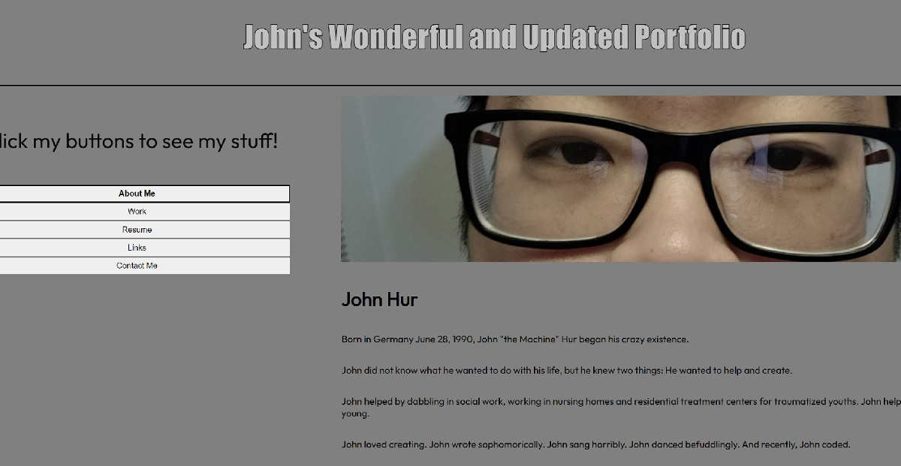
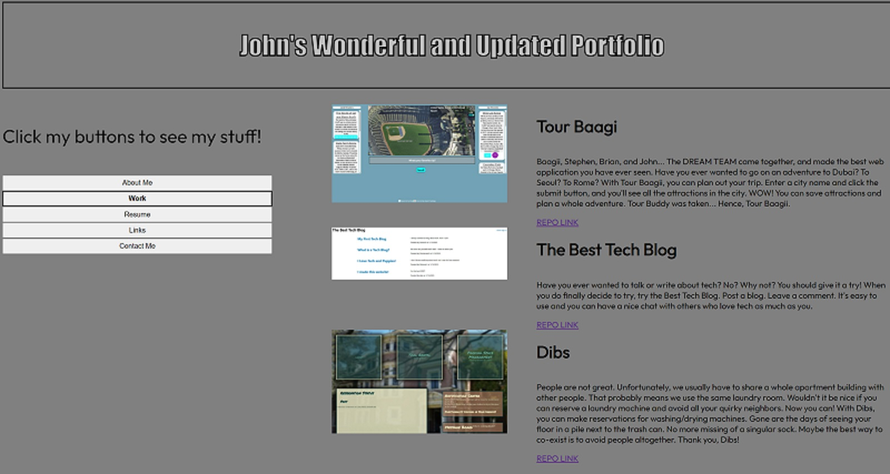
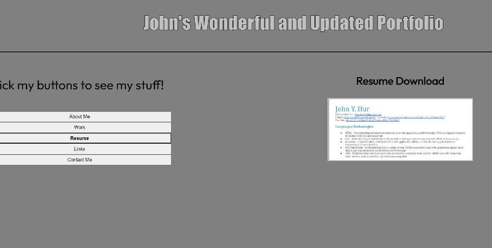
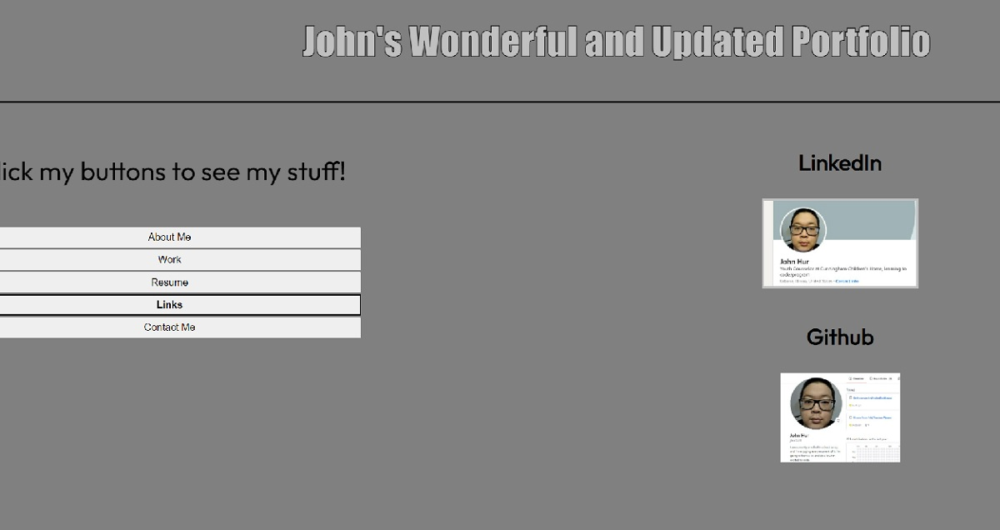
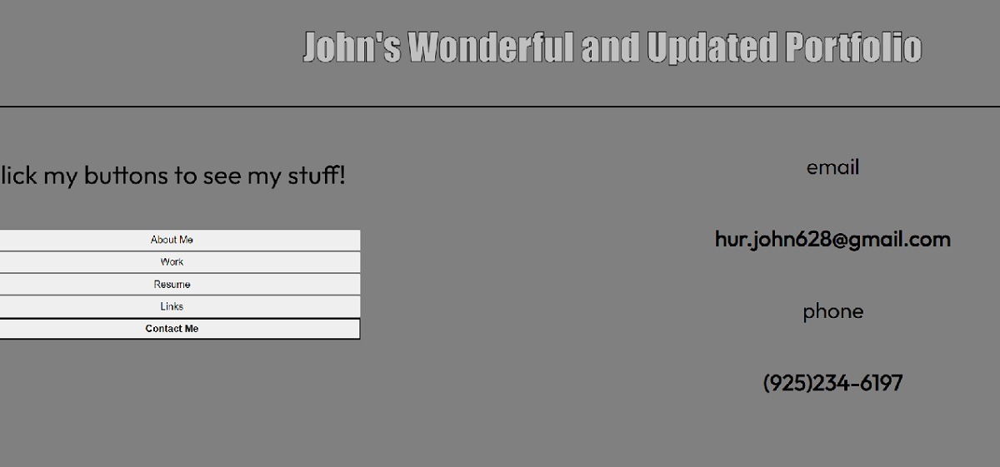
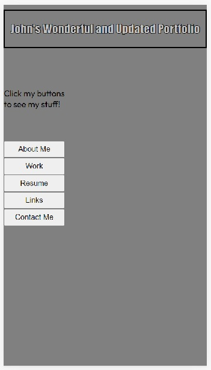

# John's Updated Portfolio

## Description

I updated my portfolio.

I made a new portfolio from scratch. Upon startup, the user is presented with five buttons. Each button is an element that will be displayed if clicked.

If the user clicks the "About Me" button, the About Me element will be displayed. If the "Work" button is pushed, the Work element will be displayed. If "Resume" is click, the Resume element is displayed. If "Links", then Links element. If "Contact Me", then Contact Me element.

I kept the the color scheme from my old portfolio as I really like gray. I used a font I found on Google Fonts, and it looks great.

I also made my portfolio mobile friendly, so it will be adapted to the tiny screans of smartphones.

## Screenshots

## Links

GitHub Repository: [https://github.com/jhur628/UpdatedJHurPortfolio](https://github.com/jhur628/UpdatedJHurPortfolio)

Deployed Application: [https://jhur628.github.io/UpdatedJHurPortfolio/](https://jhur628.github.io/UpdatedJHurPortfolio/)

LinkedIn: [https://www.linkedin.com/in/john-hur-b146aa21a/](https://www.linkedin.com/in/john-hur-b146aa21a/)

Github: [https://github.com/jhur628](https://github.com/jhur628)

## Other Comments

I don't think it was necessary to remake the whole portfolion, but to me, it was necessary. I wanted to practice using javascript and I was not too happy with my older portfolio.

As always, I had fun. I'm excited to do more, and I'm excited to see you tear my portfolio to pieces.

Thank you, and enjoy.